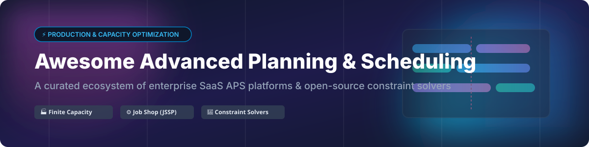

# Awesome Advanced Planning & Scheduling (APS) Ecosystem 🏭📅

  
  
  
  
  

> **A curated list of top SaaS products, enterprise platforms, and open-source constraint solvers for Advanced Planning & Scheduling (APS), finite capacity scheduling, job shop optimization (JSSP), shop-floor sequencing, and supply chain management.** 🚀

---

## 📌 Table of Contents
- [📊 SaaS & Enterprise APS Platforms](#-saas--enterprise-aps-platforms)
- [🔓 Open-Source GitHub Projects](#-open-source-github-projects)
- [🤝 How to Contribute](#-how-to-contribute)
- [💖 Support & Sponsorship](#-support--sponsorship)
- [📈 Star History](#-star-history)
- [⚠️ Disclaimer](#%EF%B8%8F-disclaimer)

---

## 📊 SaaS & Enterprise APS Platforms

> 💡 **Market Size & Industry Structure:**  
> The global **Advanced Planning and Scheduling (APS) software market** is estimated at **~$1.13 Billion to $1.3 Billion** (2025/2026) and is projected to expand to **$2.6 Billion–$10.6 Billion by 2034** (CAGR of 9%–11%).  
> The sector is **moderately fragmented**, featuring massive enterprise ERP/MOM suite giants (Siemens, Dassault Systèmes, Oracle, Infor) alongside specialized, best-of-breed APS vendors (PlanetTogether, Asprova).

The table below lists leading SaaS and enterprise APS platforms, sorted in **descending order by company scale** (estimated annual revenue / corporate valuation):

| Platform / Vendor 🏢 | Company Scale (Rev / Valuation) 💰 | Starting Pricing Tier 🏷️ | Free Tier / Trial Limit ⏳ | Description & Key Strengths 📝 |
| :--- | :--- | :--- | :--- | :--- |
| **[Siemens Opcenter APS](https://www.siemens.com/)** | **~$78 Billion** (Siemens AG Rev) | ~$20,000 / year (Enterprise quote) | 30-day trial (sales-assisted PoC) 🧪 | Enterprise detailed scheduling integrated with MES/MOM suites and shop-floor execution. |
| **[Oracle Production Scheduling](https://www.oracle.com/)** | **~$53 Billion** (Oracle Corp Rev) | ~$30,000 / year (ERP add-on quote) | Live demo only (No self-service free trial) 🚫 | APS module embedded within broad Oracle Cloud ERP/SCM suites for enterprise manufacturers. |
| **[Infor APS](https://www.infor.com/)** | **~$3.2 Billion** (Infor Rev) | ~$25,000 / year (Enterprise quote) | Guided sales demo (No self-service free trial) 🚫 | Planning & finite capacity scheduling integrated into CloudSuite ERP. |
| **[DELMIA Ortems & Quintiq](https://www.3ds.com/)** *(Dassault Systèmes)* | **~$6.1 Billion** (Dassault Rev) | ~$40,000 / year (Enterprise quote) | Proof-of-Concept demo (No self-service free trial) 🚫 | Advanced planning & optimization platforms for complex supply chain & high-mix production scheduling. |
| **[PlanetTogether](https://www.planettogether.com/)** | **~$18M – $100M** (Est. Rev) | ~$1,000 / user / month (~$50k/yr base) | Personalized demo / 14-day sales PoC 🧪 | Popular APS platform for finite capacity scheduling, what-if analysis, and multi-plant production planning. |
| **[Asprova](https://www.asprova.com/)** | **~$15M – $50M** (Est. Rev) | ~$15,000 / base module license | Trial version available via distributor request 🧪 | Specialized high-speed APS strong in discrete manufacturing, lean scheduling, & rapid rescheduling. |

---

## 🔓 Open-Source GitHub Projects

Open-source strength lies in **constraint solvers**, mathematical modeling stacks, and discrete-event simulation engines used to build custom production and job-shop schedulers.

The table below lists significant open-source scheduling projects, sorted in **descending order by GitHub Stars_Count**:

| Project / Repository 📦 | GitHub_Stars ⭐ | Language / Tech Stack 🛠️ | Description & Use Case 🎯 |
| :--- | :--- | :--- | :--- |
| **[ERPNext](https://github.com/frappe/erpnext)** |  | Python, JavaScript | Open-source ERP with manufacturing & production scheduling modules, often integrated with custom constraint engines. |
| **[Google OR-Tools](https://github.com/google/or-tools)** |  | C++, Python, Java, C# | Fast, open suite for combinatorial optimization—CP-SAT solver is widely used to build custom job-shop (JSSP) and vehicle routing schedulers. |
| **[SciPy Optimization](https://github.com/scipy/scipy)** |  | Python, C, Fortran | Fundamental scientific stack containing linear programming (`scipy.optimize.linprog`) and assignment solvers. |
| **[OptaPlanner (legacy)](https://github.com/kiegroup/optaplanner)** |  | Java, KIE | Historic open constraint solver engine for task assignment, employee rostering, and production scheduling (superseded by Timefold). |
| **[PuLP](https://github.com/coin-or/pulp)** |  | Python | Free open-source LP/MILP modeler in Python that allows symbolic constraint definition for scheduling problems. |
| **[Pyomo](https://github.com/pyomo/pyomo)** |  | Python | Python-based open-source mathematical modeling language for complex linear, mixed-integer, and non-linear production planning problems. |
| **[Timefold Solver](https://github.com/TimefoldAI/timefold-solver)** |  | Java, Kotlin, Python | Leading open-source constraint solver for production scheduling, job-shop assignment, maintenance planning, and rostering (OptaPlanner successor). |
| **[SimPy](https://github.com/simpy/simpy)** |  | Python | Process-based discrete-event simulation framework used to simulate and validate shop-floor production schedules under variance. |

---

## 🤝 How to Contribute

1. 🍴 **Fork** the repository.
2. 📝 **Add or edit** entries in `README.md` (please adhere to the tabular format and star links).
3. ℹ️ **Provide essential metadata**: platform name, link, pricing/stars, and factual 1–2 sentence description.
4. 🚀 **Submit a Pull Request (PR)** with a concise summary of changes.

---

## 💖 Support & Sponsorship

Thank you for exploring this repository! If you found this list helpful for your manufacturing operations, research, or development projects, please consider supporting the project:

- ⭐ **Star** this repository to show your appreciation.
- 🍴 **Fork** and contribute new tools or software updates.
- 📢 **Share** it with your fellow engineers, planners, and community.
- ☕ **Buy me a coffee / Sponsor**: Support ongoing maintenance via the [GitHub Sponsor Dashboard](https://github.com/sponsors/ishandutta2007).

---

## 📈 Star History

---

## ⚠️ Disclaimer

- This is a **community-curated** resource list—it is neither exhaustive nor an official commercial endorsement.
- Production schedules directly impact shop-floor safety, throughput, and customer SLA commitments. Always validate scheduling logic against real operational constraints (tooling, shifts, maintenance, BOM) prior to production deployment.
- Open-source solvers grant maximum custom flexibility but require in-house mathematical modeling expertise. Commercial APS platforms provide turnkey ERP integrations and vendor support.

---

  <b>Made for Manufacturing Engineers, Operations Researchers & Supply Chain Planners 🏭⚡</b>

